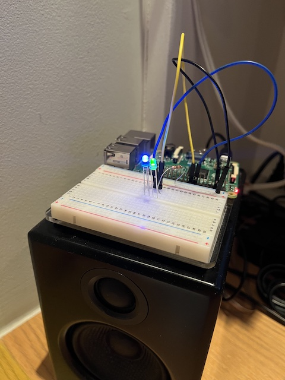
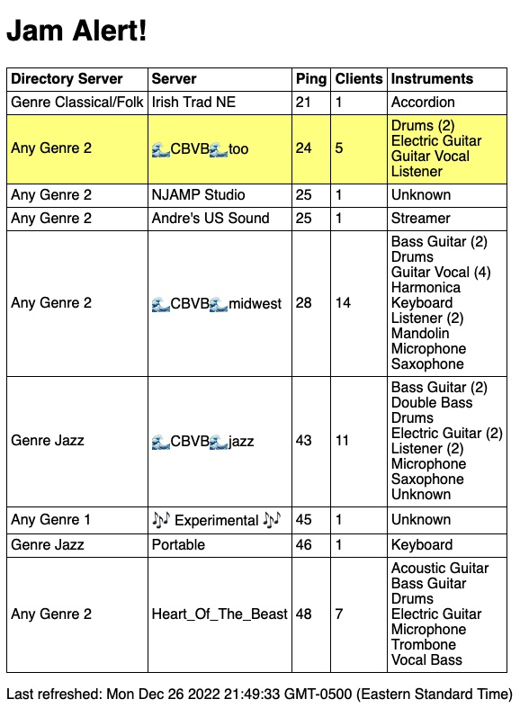

# Jam Alert

This was a holiday project meant to answer the question: "How can I find out if there are some people to jam with on [Jamulus](https://jamulus.io/) without looking at [Jamulus.live](https://jamulus.live/)"? I'm a bass player, so I'm really looking for servers where a couple people (including a drummer) have gathered without a bass player.

The goal here was to have something ambient, like a light. Here's the prototype:

 

If there are any servers with reasonable ping times that have a group of musicians that include a drummer, but not a bassist, the green light turns on. The blue light indicates that the scripts are running. If I am up for a jam, I can check the web page to see what server to join:

This is just a prototype for now. If I find it useful, I'll find something more interesting than a green LED as an indicator. I'll probably keep the Raspberry Pi part of the project though. It's running a local web server that fetches and parses the data (thanks to [jamulus-php](https://github.com/softins/jamulus-php) doing the heavy lifting here). I like the idea of using that since the ping times should be similar to what I'll actually see in Jamulus. So, far, the ping times reported by this script are higher than Jamulus, which I'm fine with. I wouldn't want it the other way.